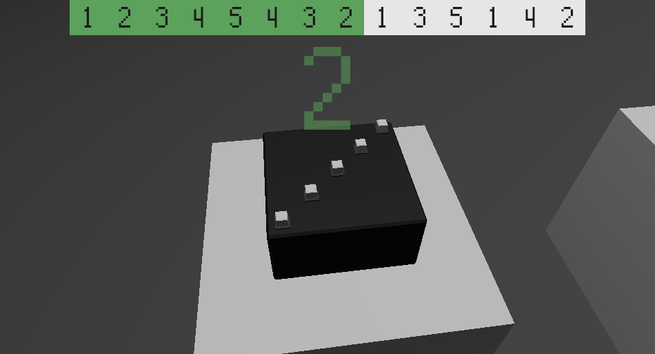

# Black Box
Black Box is, so far, a very a simple puzzle game, written using rust+amethyst.
I have no intentions to keep it simple, but as it stands now, it's a prototype.

The basic idea is that the player is given a box with buttons on it, but not
given any instructions for using it or an explanation of what the buttons do.
On every level, the player must figure out how the new box works, and then use
that knowledge to perform the desired output.

### Plans
As typical for me, this project is fairly ambitious, but I've learned from past
mistakes and tried to limit the scope somewhat.
I also don't want to give too many plans away here to avoid spoilers.
I will say that I hope to...
- make it 3d
- make it polished
- make it accessible
- make it weird and artsy
- give it a story

And, if legion ever gets merged to amethyst...
- port it to legion

### How to play
To play the most recent early release of black-box, download the most recent
release for your OS [here](https://github.com/Trouv/black-box/releases), and
run the binary/executable inside.
Or, if you want to run an even more bleeding-edge version, install rust, clone
this repository, `cd` into the directory, and run:
```
cargo run --release
```

To play, use the number-keys to press buttons and... that's it!
If you want to select a specific level, run the application from the console
and provide a level number. So, to play level 7: 
```
black-box.exe 7
```
